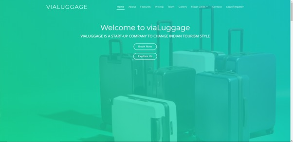
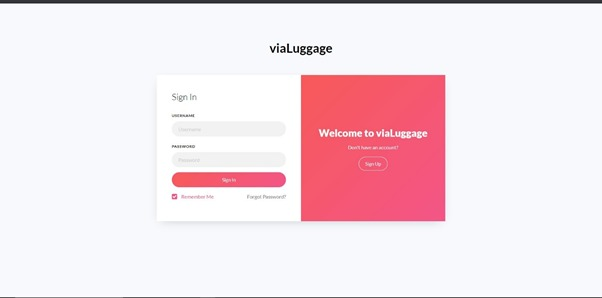
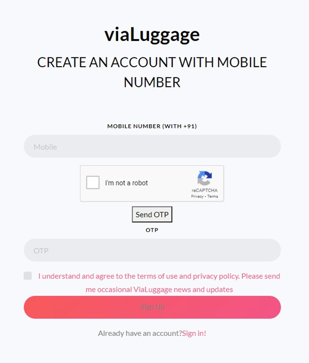
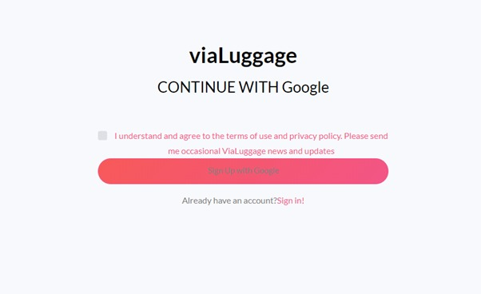
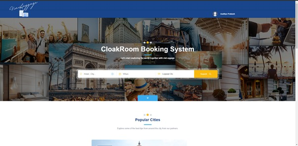
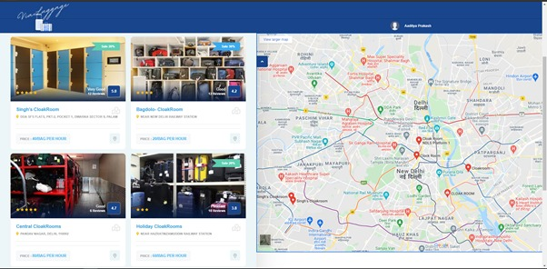
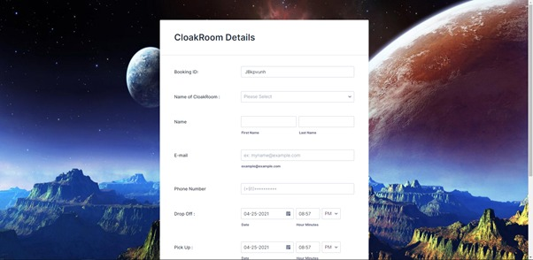

# viaLuggage 

## About viaLuggage
Our project aims to simplify and bring in advanced luggage storage solutions for tourists and visitors alike at several locations with utmost security and affordability.
To bring in affordability along with reliable security in the market to help customers to be free from exploitation due to the monopoly created by hotel chains through overcharging and a high market share.
It’s not uncommon to see tourists and visitors carrying their heavy luggage across different places to avoid massive costs of checking into expensive hotels just to have a safe space for their luggage. Neither people are very comfortable at cloakrooms due to security issues, ViaLuggage places itself in this very gap created between the lack of providers and the needs of the customers.

## Salient Features
1.Safe & Reliability  

2.Security  

3.Affordability  
 

## Bussiness Model
A future proof business would be the outcome of the project which would be directly linked to the tourism and travel, packers and movers industry. A sustained revenue source would be very much possible with greater expansion with the help of first large-scale mover advantage.

<h2 align= "left"><b>Let's Have a Look at Website 🔥</b></h2>

## Home Page  
 &ensp;  

## Login Page  
 &ensp;  

## SignUp Page  
 &ensp;  

## Phone SignUp Page  
 &ensp;  

## Google SignUp Page  
 &ensp;  

## Booking Page  
 &ensp;  

## Listing Page  
 &ensp;  

## Booking Form Page  
 &ensp;  

## Tech Stack

- JS,CSS,Bootstrap

- JotForm Form Building API

- Firebase Storage and Authentication

<h2 align= "left"><b>Demo Video and Website Link 👇</b></h2>

- Website Link : <a href="https://www.vialuggage.org/" target="_blank">www.vialuggage.org</a>
- Youtube Demo : <a href="">Soon</a>
